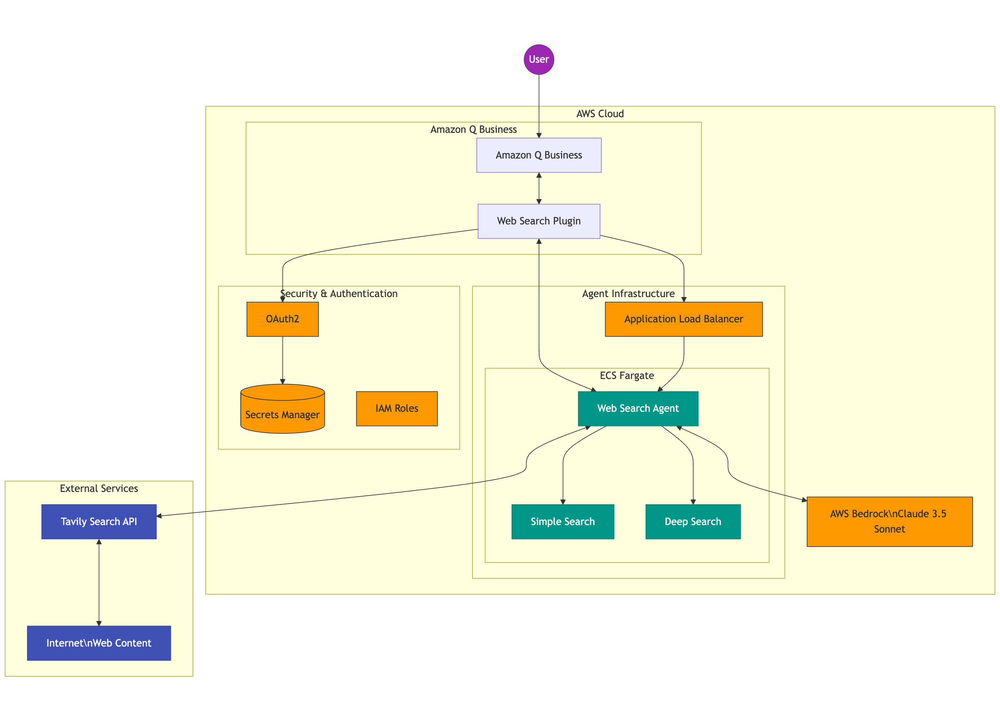
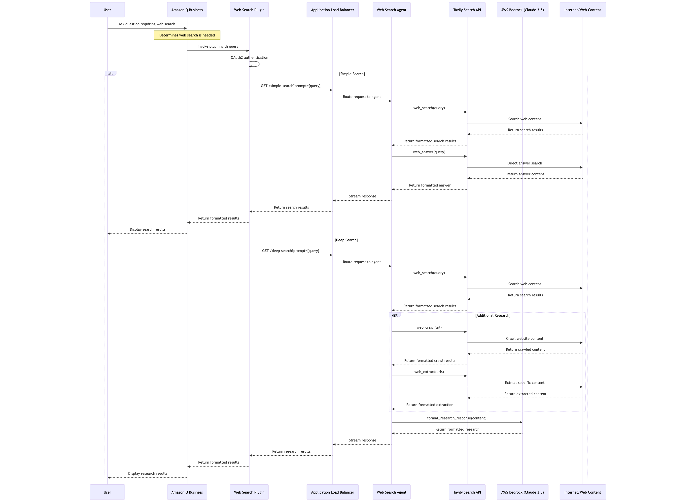

# Web Search Agent Plugin for Amazon Q Business

This project creates a new Agent built using Strands Agent SDK (https://strandsagents.com/latest/documentation/docs/api-reference/agent/) and integrates it with Amazon Q Business as a plugin. The agent provides web search capabilities within Q Business chat using the Tavily Search API.

## Architecture



The solution consists of three main components:

1. **Web Search Agent**: A Python application built with Strands Agent SDK that provides web search capabilities using Tavily Search API
2. **ECS Service**: AWS CDK infrastructure that deploys the agent as a containerized service with a load balancer
3. **Q Business Plugin**: Integration with Amazon Q Business through a custom plugin

### System Architecture Overview

The Web Search Agent Plugin for Amazon Q Business is designed as a modular, cloud-native application that enables web search capabilities within the Q Business chat interface. The architecture follows AWS best practices for security, scalability, and maintainability.

#### Data Flow

1. User asks a question in Amazon Q Business chat
2. Q Business determines the query requires web search and invokes the plugin
3. The plugin authenticates via OAuth2 and calls the Web Search Agent API
4. The agent uses Tavily Search API to search the web
5. For complex queries, additional tools like web crawling and extraction are used
6. Results are processed using Claude 3.5 Sonnet via AWS Bedrock
7. The formatted response is returned to Q Business and displayed to the user

#### Security Architecture

- **OAuth2 Authentication**: Secures access to the plugin
- **Secrets Manager**: Stores OAuth credentials securely
- **IAM Roles**: Provides least-privilege access to AWS resources
- **VPC with Private Subnets**: Isolates the agent service from direct internet access
- **Security Groups**: Controls inbound/outbound traffic

#### Deployment Architecture

The infrastructure is deployed using AWS CDK with two main stacks:
- **Agent Stack**: Deploys the Web Search Agent infrastructure
- **Plugin Stack**: Configures the Q Business plugin integration

For more detailed architecture information, see:
- [Simplified Architecture Diagram](docs/simplified-architecture-diagram.md)
- [Agent Component Diagram](docs/agent-component-diagram.md)

## Components

### Web Search Agent



The agent is built using:

- **Strands Agent SDK**: Framework for building AI agents with AWS Bedrock
- **FastAPI**: Web framework for building the API endpoints
- **LangGraph**: For agent workflow orchestration
- **Tavily Search API**: For performing web searches
- **AWS Bedrock**: For LLM capabilities (Claude 3.5 Sonnet)

The agent is defined in `agents/web-search/app/web-search.py` and exposes two main endpoints:

1. **`/simple-search`**: Performs a basic web search using the `simple_web_agent` with the following tools:
   - `web_search`: Performs a web search using Tavily API
   - `web_answer`: Provides a direct answer to a user's question using web search

2. **`/deep-search`**: Performs a comprehensive web search using the `deep_research_web_agent` with additional tools:
   - `web_search`: Performs a web search using Tavily API
   - `web_crawl`: Crawls a website and processes the results
   - `web_extract`: Extracts content from web pages
   - `format_research_response`: Formats research content into a structured response

Both endpoints accept a `prompt` parameter and return a streaming response with the search results.

For a detailed view of the agent's internal components and their interactions, see the [Agent Component Diagram](docs/agent-component-diagram.md).

### Infrastructure

The infrastructure is defined using AWS CDK in the `infra` folder and includes:

- **ECS Fargate Service**: Runs the containerized agent as a Fargate task
- **Application Load Balancer**: Exposes the service with HTTP/HTTPS endpoints
- **IAM Roles**: Provides necessary permissions for the service
- **VPC and Security Groups**: Network configuration for secure deployment

The `infra` folder contains:

- **`agent-stack.ts`**: Defines the AWS resources for deploying the Strands agent as a Fargate task
- **`plugin-stack.ts`**: Defines the AWS resources for creating and configuring the Q Business plugin
- **`config-loader.ts`**: Loads configuration from the `config.yaml` file
- **`web-search-spec.yaml`**: OpenAPI specification for the web search API

### Q Business Plugin Integration

The plugin integration is defined in `plugin-stack.ts` and uses:

- **OpenAPI Specification**: Defines the API contract in `web-search-spec.yaml`
- **Q Business Plugin**: Registers the API as a plugin in Amazon Q Business

The plugin creation process includes:
- Creating a Secret Manager entry with Cognito configuration values
- Setting up IAM roles with appropriate permissions
- Configuring OAuth2 authentication for the plugin
- Registering the plugin with Amazon Q Business using the OpenAPI specification

## Setup and Deployment

### Prerequisites

- AWS CLI configured with appropriate permissions
- Node.js and npm installed
- Docker installed
- Tavily API key (obtain from [www.tavily.com](https://www.tavily.com/))
- `config.yaml` file (use `config.example.yaml` as a template)

#### Tavily API Key

This project uses [Tavily](https://www.tavily.com/), a specialized search API designed for AI applications. Tavily provides:
- Semantic search capabilities
- Web crawling and content extraction
- Question answering based on web content
- Comprehensive search results with relevant context

To obtain a Tavily API key:
1. Visit [www.tavily.com](https://www.tavily.com/)
2. Sign up for an account
3. Navigate to your dashboard to find your API key
4. Add this key to your `config.yaml` file and/or environment variables

The `config.yaml` file must include:
- Project name
- Tavily API key
- HTTPS configuration (certificate ARN and fully qualified URL)
- QBusiness application ID
- Plugin configuration (authorization URL, token URL, scopes, and secrets)

HTTPS is required since the OpenAPI specification only supports HTTPS URLs. You must provide:
- A certificate ARN from AWS Certificate Manager
- A fully qualified URL for accessing the web search agent
- Route 53 A records should be created for this URL pointing to the Application Load Balancer

### Deployment Steps

1. Clone the repository:
   ```
   git clone https://gitlab.aws.dev/q-business-plus/agents/plugin-agent-websearch.git
   cd plugin-agent-websearch
   ```

2. Create and configure your `config.yaml` file:
   ```
   cp infra/config.example.yaml infra/config.yaml
   ```
   
   Edit the `config.yaml` file to include all required values:
   - Project name
   - Tavily API key
   - HTTPS configuration (certificate ARN and fully qualified URL)
   - QBusiness application ID
   - OAuth configuration (authorization URL, token URL, scopes)
   - OAuth secrets (client ID, client secret, redirect URI)

3. Install CDK dependencies:
   ```
   cd infra
   npm install
   ```

4. Deploy the agent stack:
   ```
   cdk deploy AgentStack 
   ```

5. Deploy the plugin stack (after the agent stack is deployed):
   ```
   cdk deploy PluginStack 
   ```

#### OAuth Authentication for QBusiness Plugin

The QBusiness Plugin uses OAuth 2.0 to authenticate with an Identity Provider (IDP) before allowing users to access the plugin. This requires:

1. **Client ID**: The identifier for your application registered with the IDP
2. **Client Secret**: The secret key for your application registered with the IDP
3. **Redirect URI**: The callback URL where users are redirected after authentication

These values must be obtained from your Identity Provider (e.g., Azure AD, Cognito) and added to your `config.yaml` file under the `plugin.secrets` section. The plugin stack creates a Secret Manager entry with these values and configures the QBusiness plugin to use OAuth authentication.

A video tutorial is available in the `docs` directory (`docs/entra-azure-app.mp4`) that demonstrates how to:
- Create an Azure app with client ID and secret in Microsoft Entra (formerly Azure AD)
- Configure the application for OAuth authorization
- Update the `config.yaml` file with the appropriate Entra/Azure authentication information

## Local Development

### Running the Agent Locally

1. Set up a Python virtual environment:
   ```
   cd agents/web-search
   python -m venv venv
   source venv/bin/activate  # On Windows: venv\Scripts\activate
   ```

2. Install dependencies:
   ```
   pip install -r app/requirements.txt
   ```

3. Create a `.env` file in the `app` directory with your Tavily API key:
   ```
   TAVILY_API_KEY=your-tavily-api-key
   ```

4. Run the application:
   ```
   cd app
   python web-search.py
   ```

The application will be available at http://localhost:8000 with the following endpoints:
- `/health`: Health check endpoint
- `/simple-search`: Simple web search endpoint
- `/deep-search`: Comprehensive web search endpoint

### Building and Testing the Docker Image

1. Build the Docker image:
   ```
   cd agents/web-search
   docker build -t web-search-agent .
   ```

2. Run the Docker container:
   ```
   docker run -p 8000:8000 -e TAVILY_API_KEY=your-tavily-api-key web-search-agent
   ```

## Usage

### API Endpoints

- **GET /health**: Health check endpoint
- **GET /search**: Search endpoint that accepts a prompt parameter and returns streaming results

Example:
```
curl "http://localhost:8000/search?prompt=who%20is%20the%20current%20president%20of%20the%20United%20States"
```

### Integration with Q Business

Once deployed and configured as a plugin in Q Business, users can access the web search capability directly in their Q Business chat interface. The plugin will be available for queries that require web search capabilities.

## How It Works

The Web Search Agent Plugin follows a streamlined process flow to deliver web search capabilities within Amazon Q Business:

### Simple Search Flow

1. User sends a query in Amazon Q Business chat
2. Q Business determines the query requires web search and invokes the plugin
3. Plugin authenticates via OAuth2 and calls the `/simple-search` endpoint
4. The agent uses the following tools:
   - `web_search`: Searches the web via Tavily API
   - `web_answer`: Gets a direct answer via Tavily API
5. Results are streamed back to Q Business and displayed to the user

### Deep Search Flow

For more complex queries requiring comprehensive research:

1. User sends a complex query in Amazon Q Business chat
2. Q Business determines deep research is needed and invokes the plugin
3. Plugin authenticates via OAuth2 and calls the `/deep-search` endpoint
4. The agent performs multiple operations:
   - Searches the web via Tavily API
   - Crawls websites for deeper information when needed
   - Extracts specific content from web pages
   - Formats research into a structured response using Claude 3.5 Sonnet
5. Comprehensive results are streamed back to Q Business and displayed to the user

This architecture enables both quick answers for simple questions and in-depth research for complex queries, all within the Q Business interface.

## Tools and Technologies

- **AWS Services**: ECS, ALB, IAM, VPC, Bedrock
- **Development**: Python, TypeScript, AWS CDK
- **AI/ML**: Strands Agent SDK, LangGraph, Claude 3.5 Sonnet
- **APIs**: Tavily Search API
- **Containerization**: Docker

## Contributing

1. Fork the repository
2. Create a feature branch
3. Make your changes
4. Submit a merge request

## License

Proprietary - Amazon Internal Use Only
