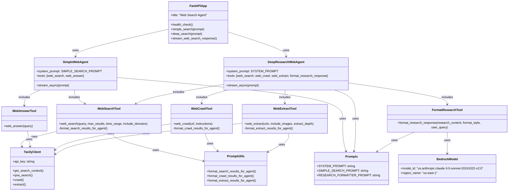

# Web Search Agent Component Diagram

## Web Search Agent Components

### API Layer
- **FastAPIApp**: The main FastAPI application that exposes the API endpoints
  - `/health`: Health check endpoint
  - `/simple-search`: Endpoint for basic web searches
  - `/deep-search`: Endpoint for comprehensive research
  - Handles request routing, parameter validation, and response streaming

### Agent Components
- **SimpleWebAgent**: Agent for basic web searches
  - Uses a simplified system prompt focused on direct answers
  - Includes basic web search tools
  - Optimized for quick, straightforward responses

- **DeepResearchWebAgent**: Agent for comprehensive research
  - Uses a more detailed system prompt for in-depth research
  - Includes additional tools for crawling and extraction
  - Designed for complex queries requiring synthesis of multiple sources

### Tool Components
- **WebSearchTool**: Performs web searches using Tavily API
  - Accepts parameters for query refinement (max results, time range, domains)
  - Formats search results for agent consumption

- **WebAnswerTool**: Provides direct answers to questions using Tavily API
  - Optimized for question-answering rather than general search
  - Returns ready-to-use responses

- **WebCrawlTool**: Crawls websites to gather deeper information
  - Follows links from a starting URL to discover related content
  - Formats crawled content for agent consumption

- **WebExtractTool**: Extracts specific content from web pages
  - Can process multiple URLs in a single request
  - Supports different extraction depths and image inclusion

- **FormatResearchTool**: Formats research content into structured responses
  - Uses Claude 3.5 Sonnet via AWS Bedrock
  - Supports different formatting styles based on user needs

### External Services
- **TavilyClient**: Client for the Tavily Search API
  - Handles API authentication and request formatting
  - Provides methods for search, Q&A, crawling, and extraction

- **BedrockModel**: Client for AWS Bedrock
  - Configured to use Claude 3.5 Sonnet
  - Handles API authentication and request formatting

### Utility Components
- **PromptUtils**: Utility functions for formatting results
  - Transforms raw API responses into agent-friendly formats
  - Ensures consistent data structures across different tools

- **Prompts**: Contains system prompts for different agent types
  - `SYSTEM_PROMPT`: For the deep research agent
  - `SIMPLE_SEARCH_PROMPT`: For the simple search agent
  - `RESEARCH_FORMATTER_PROMPT`: For formatting research content

## Component Interactions

1. **Request Flow**:
   - FastAPIApp receives HTTP requests
   - Based on the endpoint, it invokes either SimpleWebAgent or DeepResearchWebAgent
   - The agent processes the request and returns a streaming response

2. **Tool Execution**:
   - Agents use their configured tools to process the request
   - Tools interact with external services (Tavily API, AWS Bedrock)
   - Results are formatted using utility functions

3. **Response Generation**:
   - For simple searches, results are returned directly
   - For deep searches, results are processed and formatted using FormatResearchTool
   - Responses are streamed back to the client
