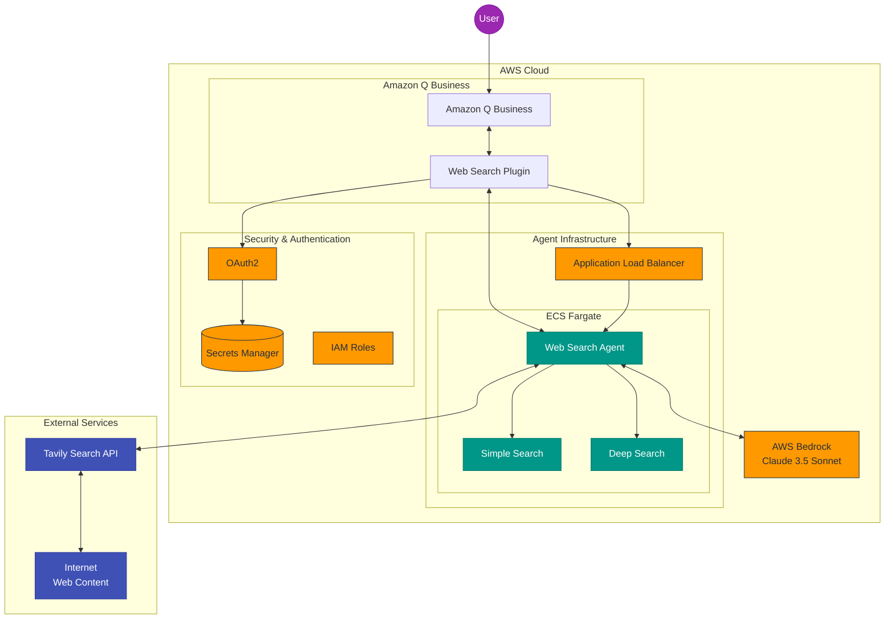

# Web Search Agent Plugin for Amazon Q Business - Simplified Architecture

## Key Components

1. **User & Amazon Q Business**
   - Users interact with Amazon Q Business chat interface
   - Q Business determines when web search is needed

2. **Web Search Plugin**
   - Integrates with Amazon Q Business
   - Uses OAuth2 for authentication
   - Communicates with the Web Search Agent via API

3. **Web Search Agent**
   - Deployed as containerized service on ECS Fargate
   - Provides two search capabilities:
     - **Simple Search**: Basic web search and direct answers
     - **Deep Search**: Comprehensive research with crawling and extraction

4. **External Services**
   - **Tavily Search API**: Provides web search, crawling, and extraction capabilities
   - **AWS Bedrock**: Provides LLM capabilities via Claude 3.5 Sonnet

5. **Security & Infrastructure**
   - **OAuth2**: Secures plugin access
   - **Secrets Manager**: Stores authentication credentials
   - **IAM Roles**: Controls access to AWS resources
   - **Application Load Balancer**: Routes traffic to the agent service

## Data Flow

1. User asks a question in Amazon Q Business
2. Q Business determines web search is needed and invokes the plugin
3. Plugin authenticates and calls the Web Search Agent API
4. Agent performs web search using Tavily API
5. For complex queries, agent uses additional tools (crawl, extract)
6. Results are processed using Claude 3.5 Sonnet
7. Formatted response is returned to Q Business and displayed to user
